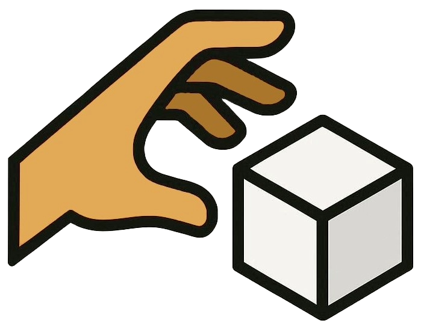

<div align="center">
  
  
  # 🔮 Handible
  
  **Revolutionary hand tracking and gesture control for the web**
  
  *Transform any webcam into a powerful 3D controller*
  
  ---
  
  [](https://www.npmjs.com/package/handible)
  [](./LICENSE)
  [](https://github.com/gust10/Handible)
  [](https://demo.handible.dev)
  
  [](https://threejs.org/)
  [](https://mediapipe.dev/)
  [](https://www.khronos.org/webgl/)
  
</div>

<br/>

<div align="center">
  
  ### ✨ **60fps Real-time** • 🎯 **21 Hand Points** • 🌐 **Web-based** • 🚀 **Zero Setup**
  
</div>

---

## 🎬 Demo

<div align="center">
  
  ```bash
  npm install handible
  ```
  
  **[📖 Documentation](https://docs.handible.dev)** • **[⚡ Try Demo](https://demo.handible.dev)** • **[🚀 Get Started](https://docs.handible.dev/getting-started)**
  
</div>

<!-- 
TODO: Add demo GIF/video here

-->

## 🌟 Why Handible?

**Handible** makes hand tracking accessible to every developer. No expensive hardware, no complex setup—just your webcam and imagination.

```javascript
import { startGestureControl, isPinching2D } from 'handible';

// 🚀 Start tracking
await startGestureControl(videoElement, scene);

// 🎯 Detect gestures  
if (isPinching2D(0)) {
  console.log('Hand 0 is pinching! 🤏');
}
```

<div align="center">
  <table>
    <tr>
      <td align="center">🎥<br/><b>Webcam Only</b><br/>No special hardware</td>
      <td align="center">⚡<br/><b>60fps Performance</b><br/>Real-time tracking</td>
      <td align="center">🎯<br/><b>21 Hand Points</b><br/>Precise detection</td>
      <td align="center">🔧<br/><b>Easy Integration</b><br/>Drop-in solution</td>
    </tr>
  </table>
</div>

## 🚀 Features

### 🎮 **Core Capabilities**
- **🤏 Pinch Detection** - Precise finger-to-thumb interactions
- **👋 Palm Recognition** - Detect palm orientation and facing direction  
- **📍 3D Hand Tracking** - Real-time 21-point hand landmarks
- **🎯 Multi-Hand Support** - Track up to 2 hands simultaneously
- **🎨 Surface Interaction** - Virtual buttons, sliders, and UI panels

### 🛠️ **Developer Experience**
- **📦 Zero Config** - Works out of the box with Three.js
- **🔧 Modular API** - Use only what you need
- **📚 TypeScript Support** - Full type definitions included
- **🎨 Customizable** - Extensive styling and behavior options
- **⚡ Performance Optimized** - GPU-accelerated tracking

### 🌐 **Integration Ready**
- **Three.js Native** - Seamless 3D scene integration
- **React Compatible** - Works with React Three Fiber
- **Framework Agnostic** - Use with any JavaScript framework
- **Mobile Responsive** - Optimized for desktop and mobile

## 📦 Installation

```bash
# npm
npm install handible

# yarn  
yarn add handible

# pnpm
pnpm add handible
```

## ⚡ Quick Start

### 1. **Basic Setup**
```javascript
import { startGestureControl, setSceneObjects } from 'handible';

// Initialize hand tracking
const videoElement = document.querySelector('#video');
const scene = new THREE.Scene();

await startGestureControl(videoElement, scene);
setSceneObjects(scene, camera, renderer);
```

### 2. **Detect Gestures**
```javascript
import { isPinching2D, getHandPosition } from 'handible';

// Check for pinch gesture
if (isPinching2D(0)) {
  const position = getHandPosition(0);
  console.log('Pinching at:', position);
}
```

### 3. **Surface Interactions**
```javascript
import { SurfaceInteractionSystem } from 'handible';

// Create interactive surface
const surface = new THREE.Mesh(geometry, material);
SurfaceInteractionSystem.registerSurface(surface, {
  width: 2,
  height: 1.5,
  cursorScaleFactor: 3.0
});
```

## � Documentation

| Section | Description |
|---------|-------------|
| **[🚀 Getting Started](https://docs.handible.dev/getting-started)** | Installation and basic setup |
| **[💡 Core Concepts](https://docs.handible.dev/core-concepts)** | Understanding gestures and tracking |
| **[📚 API Reference](https://docs.handible.dev/api-reference)** | Complete function documentation |
| **[🎯 Advanced Features](https://docs.handible.dev/advanced-features)** | Surface systems and custom interactions |

## 🎯 Use Cases

<div align="center">
  <table>
    <tr>
      <td align="center">🎮<br/><b>3D Games</b><br/>Natural hand controls</td>
      <td align="center">🎨<br/><b>Creative Tools</b><br/>Gesture-based design</td>
      <td align="center">📊<br/><b>Data Visualization</b><br/>Interactive exploration</td>
      <td align="center">🏫<br/><b>Education</b><br/>Immersive learning</td>
    </tr>
    <tr>
      <td align="center">🛍️<br/><b>E-commerce</b><br/>Product interaction</td>
      <td align="center">🏥<br/><b>Healthcare</b><br/>Touchless interfaces</td>
      <td align="center">🎭<br/><b>Entertainment</b><br/>Interactive experiences</td>
      <td align="center">🔬<br/><b>Research</b><br/>Gesture analysis</td>
    </tr>
  </table>
</div>

## 🛠️ Built With

- **[Three.js](https://threejs.org/)** - 3D graphics and rendering
- **[MediaPipe](https://mediapipe.dev/)** - Real-time hand tracking
- **[WebGL](https://www.khronos.org/webgl/)** - GPU-accelerated performance

## 🤝 Contributing

We welcome contributions! Please see our [Contributing Guide](./CONTRIBUTING.md) for details.

<div align="center">
  
  **[🐛 Report Bug](https://github.com/gust10/Handible/issues)** • **[💡 Request Feature](https://github.com/gust10/Handible/issues)** • **[💬 Discussions](https://github.com/gust10/Handible/discussions)**
  
</div>

### Development Setup
```bash
git clone https://github.com/gust10/Handible.git
cd Handible
npm install
npm run dev
```

## 📊 Performance

| Metric | Value | Description |
|--------|-------|-------------|
| **Frame Rate** | 60fps | Real-time tracking performance |
| **Latency** | ~16ms | Input to response time |
| **Hand Points** | 21 | Landmark precision per hand |
| **Max Hands** | 2 | Simultaneous tracking |

## 📄 License

MIT License - see the [LICENSE](./LICENSE) file for details.

## 🙏 Acknowledgments

- **MediaPipe Team** - For the incredible hand tracking technology
- **Three.js Community** - For the powerful 3D graphics framework  
- **Contributors** - Everyone who helped make this project better

---

<div align="center">
  
  **Made with ❤️ by [Hyunsung Shin](https://github.com/gust10)**
  
  *Transform your ideas into gestures*
  
  ⭐ **Star this repo if you find it useful!** ⭐
  
</div>

